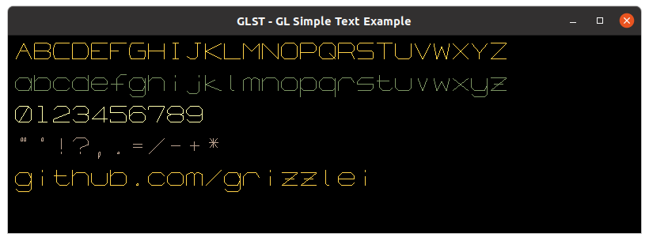

# GL Simple Text (glst) [](https://opensource.org/licenses/MIT)

simple_text.h (glst) is the SIMPLEST, single header, single font, hard coded, 2D text class for OpenGL. You can include and start using right away. 

Lower case letters will be added.



## Example

```c
#include "simple_text.h"

/// INITIALIZE: SET EVERYTHING MANUALLY
glst::simple_text letters;
letters.set_size( 20 );
letters.set_string("abcdefghijklmnopqrstuvwxyz");
letters.set_position( 20, 10 );
letters.draw( );

/// INITIALIZE: SET STRING AND POSITION
glst::simple_text numbers("0123456789", 20, 50 );

/// INITIALIZE: SET STRING, POSITION AND SIZE
glst::simple_text symbols("\"'!?,.=/+-", 20, 100, 20 );

/// INITIALIZE: SET STRING, POSITION, SIZE AND COLOR
glst::simple_text credit("github.com/peytuk", 20, 220, 20, 0, 1, 0, 1);

/// GET PROPERTIES
credit.get_size();
credit.get_string();
credit.get_position_x();
credit.get_position_y();
credit.get_color_r();
credit.get_color_g();
credit.get_color_b();
credit.get_color_a();
```

